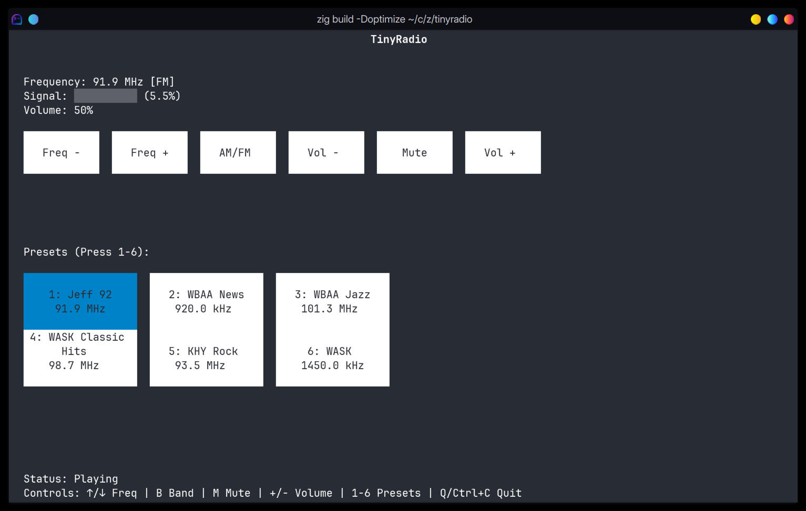

# TinyRadio

A simple software-defined radio (SDR) receiver with a terminal UI, built in Zig.

## What it does

TinyRadio turns your RTL-SDR dongle into an AM/FM radio with a text-based interface. It's not pretty, it's not optimal, its probably not even acturate, but it makes music come out of the air.



## Requirements

- [Zig](https://ziglang.org/download/) (latest version)
- RTL-SDR dongle and drivers (`librtlsdr`)
- PulseAudio (Linux)

### Installing RTL-SDR drivers

## Devbox

```bash
devbox run run
```

## Running

```bash
zig build -Doptimize=ReleaseFast run
```

## Controls

- **↑/↓** - Tune frequency
- **B** - Switch AM/FM bands  
- **M** - Mute/unmute
- **-/+** or **←/→** - Volume down/up
- **1-6** - Load presets
- **Q** or **Ctrl+C** - Quit

## Dependencies

This project is powered by the excellent [zigradio](https://github.com/vsergeev/zigradio) library by vsergeev, which does all the heavy SDR lifting. Massive credit to that project for making software-defined radio flow graphs in Zig!

## License

[MIT License](LICENSE) - see the code, hack it, break it, fix it, share it.

## Note

This is a quick-and-dirty radio app. If you're new to Zig, this might be a fun project to explore, but don't expect production quality. It's more of a "look, SDR works in Zig!" proof of concept.
